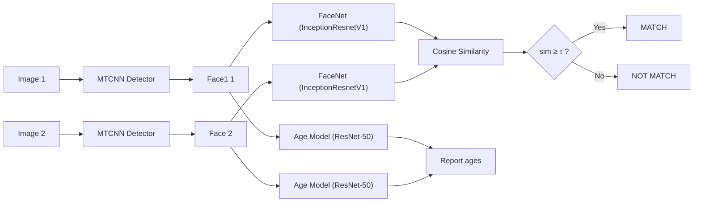

# Face Matching Across Different Ages

A lightweight pipeline that determines whether two face images belong to the **same person at different ages**.  
It detects faces (MTCNN), predicts each face’s age (custom ResNet-50 trained on **UTKFace**), embeds faces (InceptionResnetV1 / FaceNet pretrained on **VGGFace2**), and decides **MATCH / NOT MATCH** via cosine similarity.

> **Highlights**
> - End-to-end: detect → age-predict → embed → cosine-match  
> - From scratch trained age predictor, pretrained detection & embedding
> - Simple to run locally (CPU or GPU), models stored with **Git LFS**

---

## Table of Contents

- [Project Overview](#project-overview)
- [Architecture](#architecture)
- [Repository Structure](#repository-structure)
- [Setup](#setup)
  - [Prerequisites](#prerequisites)
  - [Clone with Git LFS](#clone-with-git-lfs)
  - [Create Environment & Install](#create-environment--install)
  <!-- - [CPU-only vs CUDA](#cpuonly-vs-cuda) -->
- [Quickstart](#quickstart)
- [Configuration](#configuration)
<!-- - [Reproducing Results](#reproducing-results)
  - [A) Age Prediction (UTKFace)](#a-age-prediction-utkface)
  - [B) Face Verification Across Age Gaps](#b-face-verification-across-age-gaps) -->
- [Troubleshooting](#troubleshooting)
<!-- - [Roadmap](#roadmap) -->
- [Acknowledgements](#acknowledgements)
<!-- - [License](#license) -->

---

## Project Overview

This project evaluates whether two images depict the **same identity** despite age differences.

- **Face Detection:** MTCNN (via `facenet-pytorch`)  
- **Age Prediction:** custom **ResNet-50** regressor trained from scratch on **UTKFace**  
- **Face Embedding:** **InceptionResnetV1** (FaceNet family) pretrained on **VGGFace2**  
- **Decision:** cosine similarity on L2-normalized embeddings with a configurable threshold

Typical console output:
```
Age 1: 14.91 years
Age 2: 19.78 years
Similarity: 65.51%
Decision: MATCH
```

---

## Architecture



---

## Repository Structure

```
.
├── 0_input_images/           # put exactly two test images here
├── 1_face_detected/          # optional: cropped faces saved here
├── models/                   # model weights (Git LFS)
│   ├── resnet50_age.pth
│   └── vggface2_recognition.pt
├── training_notebooks/       # age_pred.ipynb for UTKFace training
│   └── age_pred.ipynb
├── age_pred.py               # age prediction (ResNet-50) inference
├── face_detect.py            # MTCNN wrapper
├── face_match.py             # FaceNet embeddings + cosine similarity
├── myResNet.py               # Implementation of ResNet-50 architecture (age regression head)
├── config.py                 # device, paths, similarity threshold
├── main.py                   # end-to-end pipeline entry point
└── requirements.txt
```

---

## Setup

### Prerequisites

- **Python** ≥ 3.9 (3.12 recommended)  
- **Git LFS** (needed to pull model files)  

### Clone with Git LFS

```bash
# 1) Install Git LFS once on your machine
git lfs install

# 2) Clone the repo
git clone https://github.com/ahmedgamal74-cmp/Face-Matching-System-for-The-Same-Individual-at-Different-Ages.git
cd Face-Matching-System-for-The-Same-Individual-at-Different-Ages

# 3) Pull LFS-tracked weights into ./models/
git lfs pull
```

> If you skip `git lfs pull`, the files in `models/` may be only tiny pointer files and the code won’t run.

### Create Environment & Install

```bash
# (Recommended) create and activate a clean env
conda create -n cyshield_2 python=3.12 -y 
conda activate cyshield_2

# Install Python deps
python -m pip install --upgrade pip
pip install -r requirements.txt
```

The repo’s `requirements.txt` pins PyTorch CPU-only for fast reproducing

---

## Quickstart

1. **Place two images** in `0_input_images/` (JPG/PNG). If you add more than two, the pipeline uses the first two.  
2. **Run**:
   ```bash
   python main.py
   ```
3. **Outputs**:
   - Console prints: predicted ages, similarity (as %), and **MATCH / NOT MATCH**  
   - Optional crops saved to `1_face_detected/` (configurable)

---

## Configuration

Key settings live in `config.py`:

- `device`: `cuda` if available else `cpu`  
- `image_dir`: default `0_input_images`  
- `save_dir`: default `1_face_detected`  
- `age_pred_model_path`: `models/resnet50_age.pth`  
- `face_embed_model_path`: `models/vggface2_recognition.pt`  
- `threshold`: **0.50** (cosine-sim decision dafault boundary)

<!-- > Tune `threshold` after you compute ROC on a validation split (see **Reproducing Results**). A stricter threshold reduces false matches, a looser threshold raises recall. -->

---

<!-- ## Reproducing Results

### A) Age Prediction (UTKFace)

1. **Download UTKFace** and place it under, e.g., `data/UTKFace/` (each file name encodes the age label).  
2. Open `training_notebooks/age_pred.ipynb` and update the dataset path.  
3. Train the **ResNet-50** age regressor with the provided augmentations and **SmoothL1 (Huber)** loss.  
4. Report:
   - **MAE** (years) and **RMSE** (years) on validation/test  
   - MAE by age group (0–12, 13–29, 30–49, 50+)  
5. Save the trained weights as `models/resnet50_age.pth` (already tracked via Git LFS).

> Notes: UTKFace contains label noise; Huber loss is chosen for robustness. Subject-disjoint splits are preferred when possible.

### B) Face Verification Across Age Gaps

Prepare a CSV of pairs and run an evaluation pass to compute ROC/AUC/EER/TPR@1%FPR.

**CSV format (`pairs.csv`):**
```csv
img1,img2,label,age_gap
0_input_images/a.jpg,0_input_images/b.jpg,1,10.2
path/to/neg1.jpg,path/to/neg2.jpg,0,7.5
...
```
- `label`: 1 for **same person**, 0 for **different persons**  
- `age_gap`: absolute years difference (optional but useful for bin analysis)

**Example evaluation snippet (drop into a separate script or notebook):**
```python
import numpy as np, pandas as pd
from sklearn.metrics import roc_curve, auc
from PIL import Image
from face_detect import face_detect
from face_match import check_similarity

def eer_from_roc(fpr, tpr):
    fnr = 1 - tpr
    i = np.nanargmin(np.abs(fnr - fpr))
    return max(fpr[i], fnr[i])

df = pd.read_csv("pairs.csv")
sims, ys = [], []

for _, r in df.iterrows():
    img1 = Image.open(r["img1"]).convert("RGB")
    img2 = Image.open(r["img2"]).convert("RGB")
    faces = face_detect([img1, img2], save_dir=None)
    sim = check_similarity(faces)  # returns cosine similarity in [0,1]
    sims.append(sim); ys.append(int(r["label"]))

fpr, tpr, thr = roc_curve(ys, sims)
print("AUC:", auc(fpr, tpr))
print("EER:", eer_from_roc(fpr, tpr))

# TPR @ 1% FPR
target = 0.01
tpr_at_1p = np.interp(target, fpr, tpr)
print("TPR@1%FPR:", tpr_at_1p)

# choose a threshold for deployment (example: maximize TPR@1%FPR)
# or pick thr[np.nanargmin(np.abs(fpr-target))] and put it into config.threshold
```

> After choosing your operating threshold `τ`, update `config.py` → `threshold = τ` and note it in your README/results.

--- -->

## Troubleshooting

- **“Model file looks like text / tiny size”**  
  You didn’t fetch LFS content. Run:
  ```bash
  git lfs install
  git lfs pull
  ```
- **CUDA errors / version mismatch**  
  The default wheels target **cpu**. Either install CUDA 12.1 or stay CPU wheels (see Setup).
- **`facenet_pytorch` not found**  
  Re-run: `pip install -r requirements.txt`
- **No face detected**  
  Try higher-resolution images or increase MTCNN margin in `face_detect.py` (e.g., `margin=40→60`). Check lighting and frontal pose.
- **Multiple faces in a photo**  
  The pipeline uses **largest face only**. For group photos, crop the target face manually or extend detector to `keep_all=True` and add a selection heuristic.

---

<!-- ## Roadmap

- Threshold calibration tool (auto-sweep and plots)  
- Optional multi-face selection (`keep_all=True` + heuristic)  
- Cross-age fine-tuning of embeddings (ArcFace/AdaFace) on age-diverse identity sets  
- Domain calibration (CCTV/IR) and image-quality gating  
- Fairness slice metrics by age bands and demographics

--- -->

## Acknowledgements

- **UTKFace** dataset (age labels)  
- **VGGFace2** pretraining for InceptionResnetV1  
- **facenet-pytorch** for MTCNN and FaceNet backbones

---

<!-- ## License

Specify your chosen license (e.g., MIT) in a `LICENSE` file. Until then, all rights reserved by default. -->
